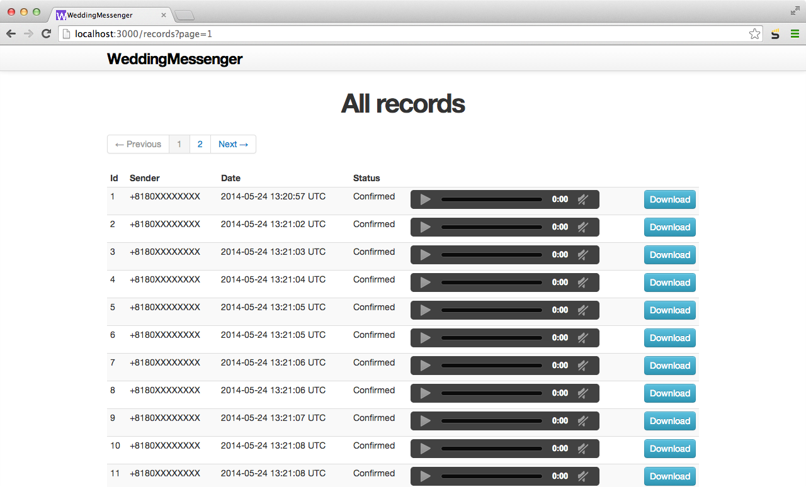

# WeddingMessenger

Twilio を使って電話で祝電を集めるアプリケーションです。  
集めた祝電を iPod shuffle などに入れてプレゼントすると大変喜ばれます。

## 用意するもの

* Twilio アカウント（無料アカウントでも可）
* Heroku アカウント

## インストール

Heroku にデプロイして使います。

    $ git clone https://github.com/keitanxkeitan/WeddingMessenger.git
    $ cd WeddingMessenger
    $ heroku create
    $ git push heroku master
    $ heroku run rake db:migrate

Heroku にデプロイできたら Twilio にログインして、
任意の Twilio 電話番号の *Request URL* に
`(Heroku アプリの URL)/welcome`
を設定してください。

これで、先ほど設定した Twilio 電話番号に電話をかけると祝電を録音できます。

## 管理
`(Heroku アプリの URL)/records`
で録音された祝電を再生、ダウンロードできます。

## FAQ

Q. 音声ガイドを自分で用意した音声ファイルにしたい  
A. 音声ファイルをアップロードして、`Play AUDIO_FILE_URL` とすると音声ファイルが再生されます。詳しくは app/controller/twilio_controller.rb を参照のこと。

Q. 録音可能時間を変更したい（デフォルト60秒）  
A. Record の引数 maxLength の値を変更してください。詳しくは app/controller/twilio_controller.rb を参照のこと。

by keitanxkeitan
